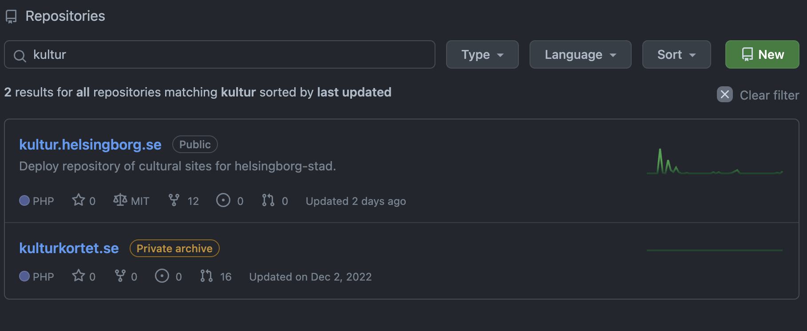
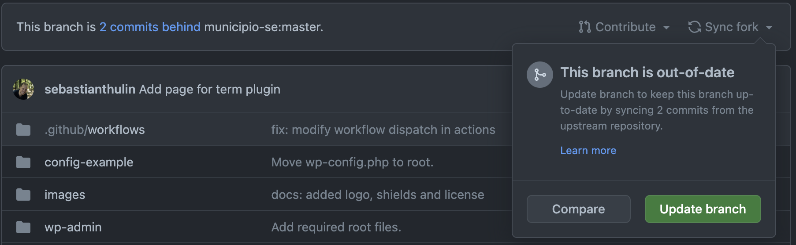
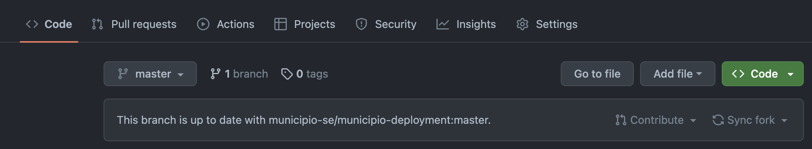
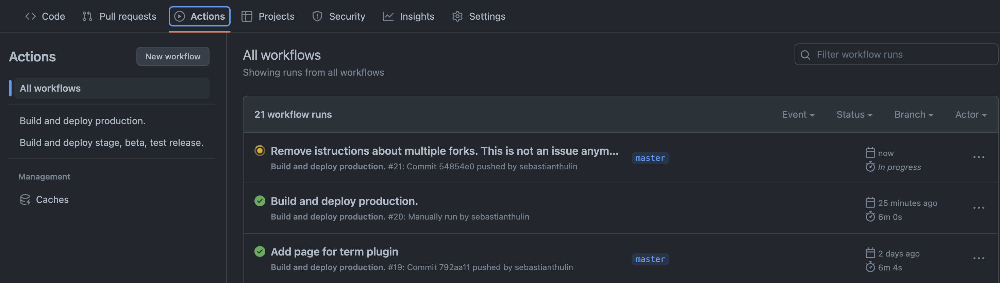

# Användarguide - Deployment Municipio
Den här användarguiden beskriver hur du kan starta ett nytt bygge av din webbplats. Guiden kräver inga förkunskaper. 

## Vad syftar ett nytt bygge till? 
Ett bygge är en färsk uppdatering av din webbplats. Det innebär att du efter att bygget är klart, kommer få den senaste officiella versionen av Municipio installerad för din webbplats. 

## Vilka risker finns? 
Det finns alltid en risk att något går fel när man bygger om en webbplats. Om vi märker att något går snett, kommer bygget att avbrytas. Det informeras tydligt i githubs-gränssnitt om ett bygge går fel. 

Bygget innehåller tester, som verfierar att koden fungerar som den ska, innan den skickas till din webbplats/webbserver. 

## Vad ska jag göra om byggena inte går igenom? 
Vänd dig först och främst till den som administrerar webbservern. Den personen kan se varför bygget inte går igenom. Om denna person inte kan reda ut problemet på egen hand. Ta då kontakt med författaren av byggscriptet. 

# Steg för steg guide

## Starta ett bygge

### 1. Logga in på ditt github konto. 
Du behöver ett githubkonto kopplat till din organisation (där koden lagras).

### 2. Klicka på den webbplats du vill uppdatera i repo-listan. 

### 3. Klicka på knappen "sync fork" och välj alternativet "update branch". 
Om knappen inte är aktiv, finns inga nya updpateringar ännu för munipio. 

### 4. Klicka på "Actions" i toppmenyn

### 5. Vänta tills jobbet har körts färdigt. 
Denna process tar normalt sett mellan 5 och 10 minuter, men kan dröja längre beroende på tillgängig kapacitet hos github. 
